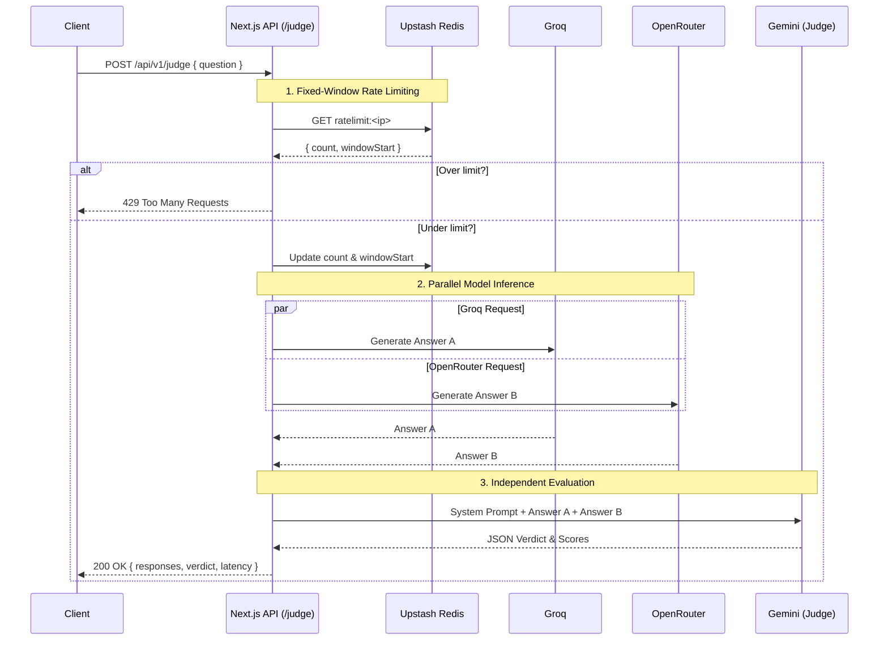
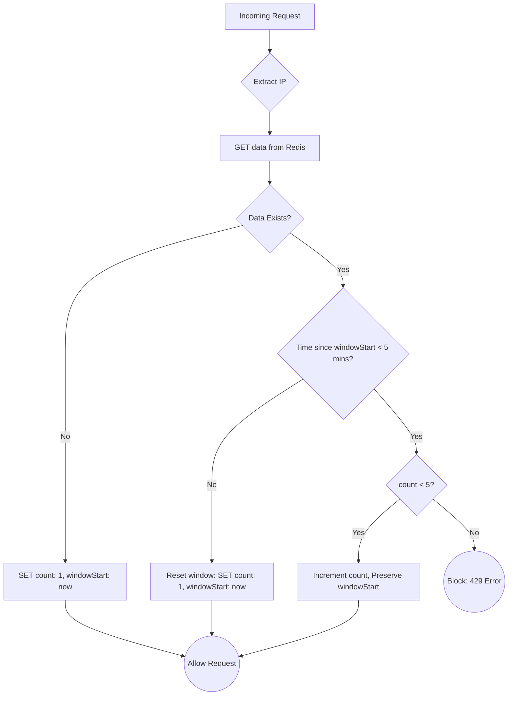

# Model Matrix 

Welcome to **Model Matrix**, a Next.js web application engineered to test, compare, and evaluate various Large Language Models (LLMs) from different providers side-by-side. 

## Features

- **Multi-Provider Support**: Seamlessly integrate with cutting-edge AI providers like OpenAI, Google GenAI, Groq, and OpenRouter.
- **Independent Evaluation**: Leverage a powerful judge (like Gemini 2.5 Flash) to objectively evaluate responses, provide factual accuracy breakdowns, and select a definitive winner.
- **Strict Rate Limiting**: Built-in production-ready rate limiting using a custom fixed-window algorithm backed by **Upstash Redis** (allows 5 requests per 5-minute window per IP) to prevent abuse and protect API quotas.
- **Premium Monochrome UI**: A sleek, strict black-and-white interface using **Plus Jakarta Sans**, offering a clean SaaS aesthetic.
- **Seamless Theme Switching**: Fully integrated dark and light mode support via `next-themes` with dynamic semantic colors that effortlessly transition without flickering.

## Architecture & API Flow

Model Matrix utilizes a highly optimized parallel inference flow to generate answers simultaneously, evaluate them, and return the verdict to the user.



### Rate Limiting Logic

To prevent abuse, the API uses a custom **Fixed-Window Rate Limiter** backed by Redis. This ensures a user (tracked by IP address) can strictly only make 5 requests per 5-minute window without suffering from the sliding-window penalty bug.



## Tech Stack

- **Framework**: [Next.js 16](https://nextjs.org/) (App Router)
- **Styling**: [Tailwind CSS v4](https://tailwindcss.com/) & Vanilla CSS
- **Components**: [Shadcn UI](https://ui.shadcn.com/)
- **Icons**: [Lucide React](https://lucide.dev/)
- **Database / Rate Limiting**: [Upstash Redis](https://upstash.com/)
- **LLM SDKs**:
  - `@google/genai`
  - `@openrouter/sdk`
  - `groq-sdk`
  - `openai`

## Getting Started

### Prerequisites

- Node.js (v20+ recommended)
- npm, yarn, pnpm, or bun

### Installation

1. Clone the repository and install dependencies:
   ```bash
   npm install
   ```

2. Set up environment variables:
   Create a `.env` file in the root directory and add your API keys. Make sure to include your Upstash Redis credentials for the rate limiter:
   ```env
   # AI Providers
   OPENAI_API_KEY=your_openai_api_key
   GOOGLE_GENAI_API_KEY=your_google_api_key
   GROQ_API_KEY=your_groq_api_key
   OPENROUTER_API_KEY=your_openrouter_api_key

   # Database (Rate Limiting)
   UPSTASH_REDIS_REST_URL=your_upstash_url
   UPSTASH_REDIS_REST_TOKEN=your_upstash_token
   ```

3. Run the development server:
   ```bash
   npm run dev
   ```

4. Open [http://localhost:3000](http://localhost:3000) with your browser to see the result.

## Development

- The main interface is located at `app/page.tsx`.
- The evaluation and rate-limiting logic is securely handled inside the API route: `app/api/v1/judge/route.ts`.
- Ensure any UI additions adhere to the strict monochrome SaaS design system mapped out in `globals.css` and the theme toggle settings.

## License

This project is licensed under the MIT License.
